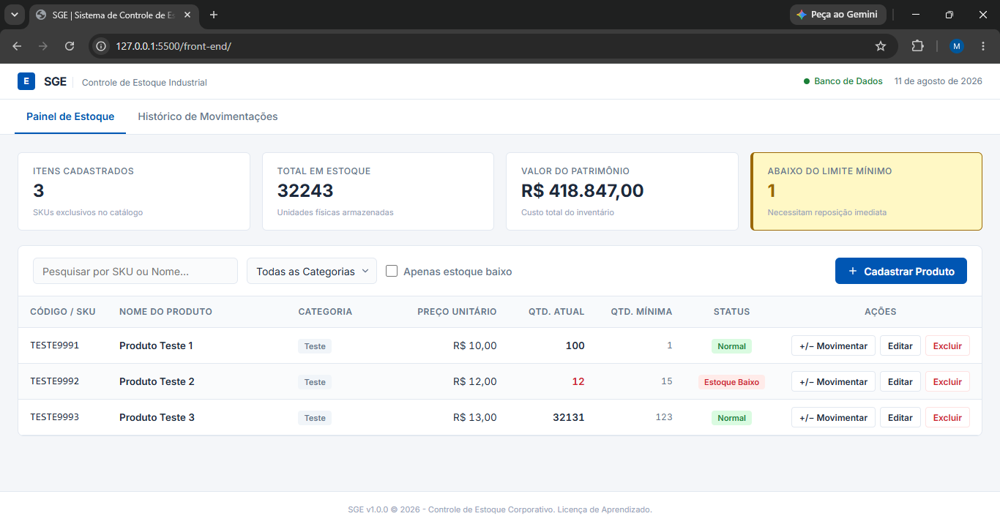
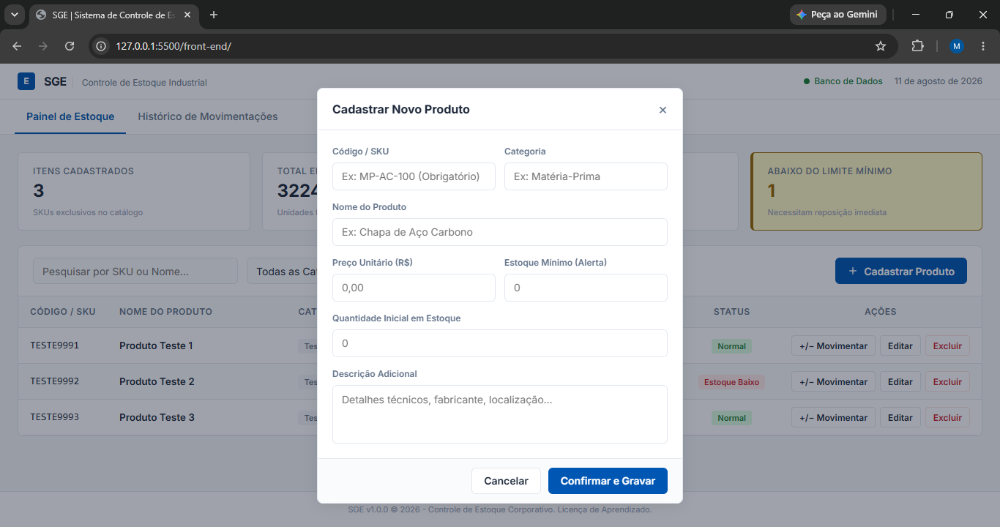
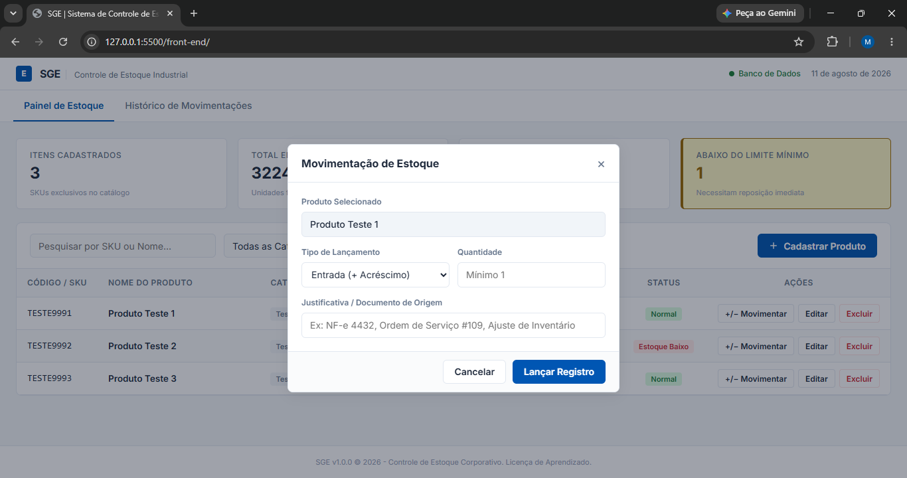
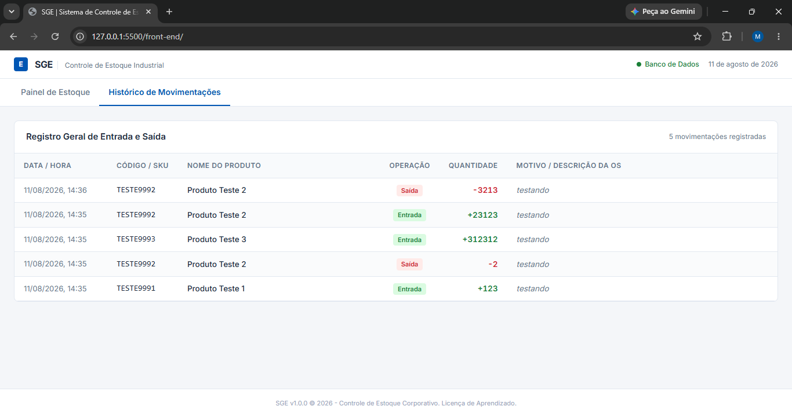

# SGE | Sistema de Controle de Estoque

<p align="center">
  <strong>Sistema de gerenciamento de estoque para controle de produtos, movimentações e histórico de operações.</strong>
</p>

<p align="center">
  
  
  
  
  
</p>

---

## ◈ Demonstração


Demonstração do fluxo principal do sistema, incluindo cadastro de produtos, controle de estoque, movimentações e consulta do histórico.

---

## ◈ Sobre o projeto

O SGE (Sistema de Gestão de Estoque) é uma aplicação desenvolvida para facilitar o gerenciamento de produtos e o controle das movimentações de entrada e saída de estoque.

O sistema permite cadastrar produtos, atualizar informações, excluir registros, controlar quantidades disponíveis e registrar movimentações, mantendo um histórico das operações realizadas.

O projeto utiliza uma arquitetura baseada no padrão MVC (Model View Controller), separando as responsabilidades entre as diferentes camadas da aplicação.

---

## ◈ Funcionalidades

### Gerenciamento de produtos

```text
[✓] Cadastro de produtos
[✓] Edição de produtos
[✓] Exclusão de produtos
[✓] Consulta de produtos
[✓] Controle de SKU
[✓] Controle de categoria
[✓] Controle de preço
[✓] Controle de quantidade
[✓] Definição de estoque mínimo
[✓] Descrição adicional do produto
```

### Movimentação de estoque

```text
[✓] Registro de entradas
[✓] Registro de saídas
[✓] Validação de estoque insuficiente
[✓] Atualização automática da quantidade em estoque
[✓] Registro do motivo da movimentação
[✓] Histórico de movimentações
```

### Dashboard

```text
[✓] Total de SKUs cadastrados
[✓] Total de itens em estoque
[✓] Valor total do inventário
[✓] Quantidade de produtos abaixo do estoque mínimo
[✓] Indicador visual de estoque baixo
```

### Filtros

```text
[✓] Pesquisa por nome
[✓] Pesquisa por SKU
[✓] Filtro por categoria
[✓] Filtro de produtos com estoque baixo
[✓] Limpeza dos filtros
```

---

## ◈ Interface

A interface foi desenvolvida com foco em organização, simplicidade e visualização rápida das informações.

### Painel de Estoque



O painel principal apresenta os indicadores gerais do estoque e a tabela com os produtos cadastrados.

### Cadastro de Produto



O formulário permite cadastrar informações como SKU, nome, categoria, preço, quantidade inicial, estoque mínimo e descrição.

### Movimentação de Estoque



A movimentação permite registrar entradas e saídas de produtos, informando a quantidade e o motivo da operação.

### Histórico de Movimentações



O histórico apresenta as movimentações realizadas, incluindo data, produto, SKU, tipo de operação, quantidade e motivo.

---

## ◈ Arquitetura

O backend foi estruturado seguindo uma arquitetura baseada no padrão MVC, separando as responsabilidades da aplicação.

```text
controle-estoque/
│
├── controllers/
│   ├── movimentacoesController.js
│   └── produtosController.js
│
├── middlewares/
│   └── validarProduto.js
│
├── models/
│   ├── movimentacaoModel.js
│   └── produtoModel.js
│
├── routes/
│   ├── movimentacoes.js
│   └── produtos.js
│
├── db.js
├── server.js
├── api.js
├── app.js
├── index.html
├── style.css
└── README.md
```

### Fluxo da aplicação

```text
Frontend
   │
   │ HTTP / JSON
   ▼
Routes
   │
   ▼
Controllers
   │
   ▼
Models
   │
   ▼
MySQL
```

A separação das camadas permite manter o código organizado e facilita a manutenção e evolução do sistema.

---

## ◈ API

A aplicação possui uma API REST responsável pela comunicação entre o frontend e o banco de dados.

### Produtos

| Método | Endpoint                   | Descrição                 |
| :----: | -------------------------- | ------------------------- |
|   GET  | `/produtos`                | Lista todos os produtos   |
|  POST  | `/produtos`                | Cadastra um novo produto  |
|   PUT  | `/produtos/:id`            | Atualiza um produto       |
| DELETE | `/produtos/:id`            | Exclui um produto         |
|   PUT  | `/produtos/:id/movimentar` | Registra entrada ou saída |

### Movimentações

| Método | Endpoint         | Descrição                          |
| :----: | ---------------- | ---------------------------------- |
|   GET  | `/movimentacoes` | Lista o histórico de movimentações |

---

## ◈ Banco de Dados

O sistema utiliza MySQL para armazenamento persistente dos dados.

### Tabela `produtos`

Responsável pelo armazenamento dos produtos cadastrados.

```text
id
sku
nome
categoria
preco
quantidade
quantidade_minima
descricao
```

### Tabela `movimentacoes`

Responsável pelo armazenamento do histórico das operações realizadas no estoque.

```text
id
produto_id
tipo
quantidade
motivo
data_movimentacao
```

A tabela `movimentacoes` possui um relacionamento com `produtos` através da chave estrangeira `produto_id`.

A exclusão de um produto utiliza `ON DELETE CASCADE`, permitindo que as movimentações relacionadas sejam removidas automaticamente.

---

## ◈ Tecnologias

### Frontend

```text
HTML5
CSS3
JavaScript
Fetch API
```

### Backend

```text
Node.js
Express.js
CORS
MySQL2
```

### Banco de dados

```text
MySQL
InnoDB
Foreign Keys
```

### Ferramentas

```text
Git
GitHub
Visual Studio Code
```

---

## ◈ Como executar

### 1. Clone o repositório

```bash
git clone https://github.com/miguelotth/sistema-controle-estoque.git
```

### 2. Entre na pasta do projeto

```bash
cd sistema-controle-estoque
```

### 3. Instale as dependências

```bash
npm install
```

### 4. Configure o banco de dados

Crie um banco de dados MySQL e configure as tabelas `produtos` e `movimentacoes`.

Depois, configure as credenciais de conexão no arquivo `db.js`.

Exemplo:

```javascript
const mysql = require("mysql2");

const db = mysql.createConnection({
    host: "localhost",
    user: "root",
    password: "SUA_SENHA",
    database: "controle_estoque"
});

module.exports = db;
```

Não publique senhas ou credenciais reais no GitHub.

### 5. Inicie o servidor

```bash
node server.js
```

O backend será iniciado em:

```text
http://127.0.0.1:3000
```

### 6. Execute o frontend

Abra o arquivo `index.html` através do ambiente utilizado no projeto.

---

## ◈ Validações

O sistema possui validações para evitar inconsistências no controle do estoque.

### Estoque insuficiente

Uma saída não pode ser registrada quando a quantidade solicitada é maior que o estoque disponível.

```text
Estoque atual: 5
Saída solicitada: 8

[!] Estoque insuficiente
```

### Estoque mínimo

Produtos abaixo da quantidade mínima configurada recebem o status `Estoque Baixo` e são contabilizados no indicador correspondente do dashboard.

### Exclusão de produtos

A exclusão de um produto remove automaticamente suas movimentações relacionadas através da restrição:

```sql
ON DELETE CASCADE
```

---

## ◈ Fluxo de funcionamento

```text
┌──────────────────────┐
│ Cadastro de Produto  │
└──────────┬───────────┘
           │
           ▼
┌──────────────────────┐
│ Produto armazenado   │
│ no MySQL             │
└──────────┬───────────┘
           │
           ▼
┌──────────────────────┐
│ Entrada / Saída      │
│ de estoque           │
└──────────┬───────────┘
           │
           ├──────────────► Atualiza quantidade
           │
           ▼
┌──────────────────────┐
│ Registra movimentação│
└──────────┬───────────┘
           │
           ▼
┌──────────────────────┐
│ Histórico            │
└──────────────────────┘
```

---

## ◈ Objetivos do projeto

O projeto foi desenvolvido com o objetivo de praticar e consolidar conhecimentos em:

```text
• Desenvolvimento de APIs REST
• Node.js e Express
• Integração com MySQL
• Arquitetura MVC
• Operações CRUD
• Relacionamentos entre tabelas
• JavaScript assíncrono
• Consumo de APIs com Fetch
• Manipulação do DOM
• Validação de dados
• Controle de estoque
• Git e GitHub
• Organização de projetos Full Stack
```

---

## ◈ Melhorias futuras

```text
[ ] Sistema de autenticação
[ ] Controle de usuários e permissões
[ ] Dashboard com gráficos
[ ] Exportação de relatórios
[ ] Paginação das tabelas
[ ] Filtros avançados no histórico
[ ] Relatórios em PDF
[ ] Controle de fornecedores
[ ] Controle de localização dos produtos
[ ] Documentação da API com Swagger
[ ] Testes automatizados
[ ] Deploy da aplicação
```

---

## ◈ Status

```text
STATUS: CONCLUÍDO
VERSÃO: 1.0.0
```

A versão atual possui gerenciamento de produtos, movimentação de estoque, histórico de operações, dashboard e persistência dos dados em MySQL.

---

## ◈ Autor

**Miguel Othon**

Desenvolvedor em formação com interesse em desenvolvimento Full Stack, infraestrutura e tecnologias backend.

### Links

[GitHub](https://github.com/miguelotth)

[Repositório do projeto](https://github.com/miguelotth/sistema-controle-estoque)

---

<p align="center">
  Desenvolvido utilizando Node.js, Express e MySQL.
</p>
